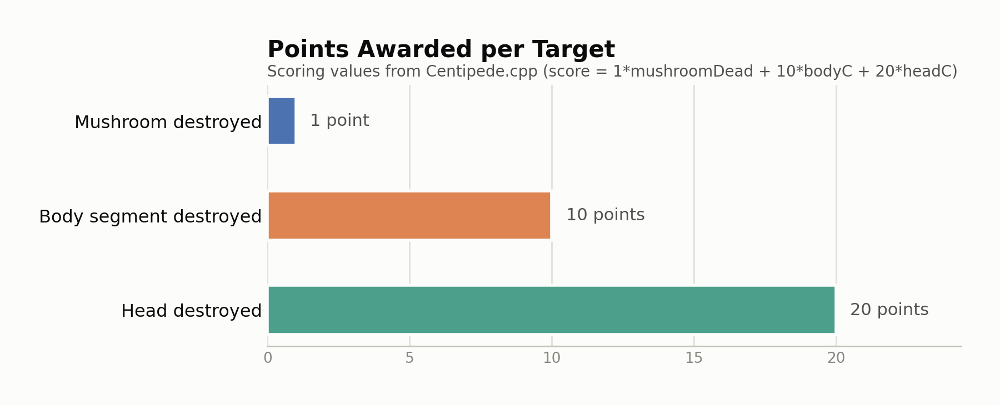
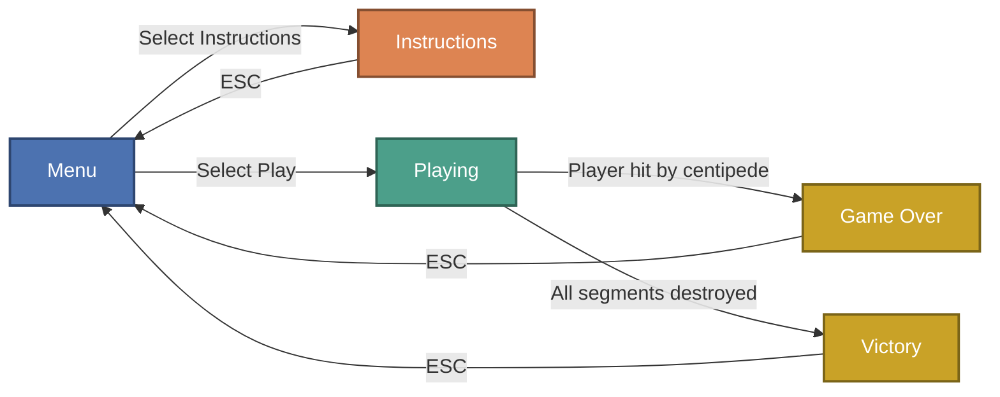

# Centipede Clone

A modern C++14 clone of the classic arcade game **Centipede**, built using [SFML](https://www.sfml-dev.org/) for graphics and audio. The game features a menu, instructions, scoring, and classic centipede gameplay with mushrooms, bullets, and split mechanics.

## Features

- Classic centipede gameplay: shoot the centipede as it winds through a field of mushrooms.
- Player movement and shooting (arrow keys, spacebar, or mouse click).
- Dynamic centipede splitting and direction reversal when segments are hit.
- Mushrooms (including poison and half-destroyed states) that can be destroyed for points.
- Menu system with Play, Instructions, and Quit options.
- Victory and Game Over screens with scoring.
- Background music and sound effects.

## Project at a Glance

Scoring is computed directly from three counters tracked in `Centipede.cpp` (`score = 1*mushroomDead + 10*bodyC + 20*headC`) — hitting the centipede's head is worth 20x more than clearing a mushroom:

<picture>
  <source media="(prefers-color-scheme: dark)" srcset="docs/charts/scoring-by-target-dark.png">
  
</picture>

### Game state flow

The game runs on a `GameState` enum (`MENU`, `PLAYING`, `INSTRUCTIONS`, `GAME_OVER`, `VICTORY`). Instructions is a side branch off the menu, while Playing resolves into either ending based on whether the player dies first or clears every centipede segment first:

### Sprite gallery

A sample of the real shipped game art from `CentipedeClone/Textures/`:

<table>
<tr>
<td align="center"> player.png</td>
<td align="center"> c_head_left.png</td>
<td align="center"> mushroom.png</td>
<td align="center"> halfMushroom.png</td>
</tr>
<tr>
<td align="center"> explosion.png</td>
<td align="center"> spider_and_score.png</td>
<td align="center"> game_over.png</td>
<td align="center"> you_won.png</td>
</tr>
</table>

## Controls

- **Arrow Keys**: Move player
- **Spacebar** or **Mouse Click**: Shoot bullet
- **ESC**: Return to menu

## Scoring

- **Mushroom destroyed**: 1 point
- **Centipede body segment destroyed**: 10 points
- **Centipede head destroyed**: 20 points

## How to Build

1. **Dependencies**:
    - [SFML 2.5+](https://www.sfml-dev.org/download.php) (Graphics, Window, Audio)
    - C++14 compatible compiler (tested with Visual Studio 2022)

2. **Project Setup**:
    - Place all required textures in a `Textures/` folder:
        - `player.png`
        - `bullet.png`
        - `c_head_left.png`
        - `c_body_left.png`
        - `mushroom.png`
        - `halfMushroom.png`
        - `game_over.png`
        - `you_won.png`
    - Place background music in a `Music/` folder:
        - `field_of_hopes.ogg`
    - Place a font file (e.g., `arial.ttf`) in the project root.

3. **Build**:
    - Open the solution in Visual Studio 2022.
    - Ensure SFML include and lib directories are set in project properties.
    - Build and run.

## How to Play

- Select "Play Game" from the menu.
- Move your player using the arrow keys.
- Shoot at the centipede and mushrooms to score points.
- Avoid colliding with the centipede.
- The game ends in victory when all centipede segments are destroyed, or game over if the player is hit.

## Notes

- Window size and position can be adjusted in the code (`window.setSize`, `window.setPosition`).
- All assets must be present in the correct folders for the game to run.
- The game grid and logic are tuned for a 960x960 resolution but can be adjusted.
- SFML is vendored under `include/` and `lib/` for convenience so the project builds without a separate SFML install.

## License

This project is for educational purposes. All third-party assets (images, music, fonts) should be properly licensed for your use.

---

Enjoy playing Centipede Clone!
