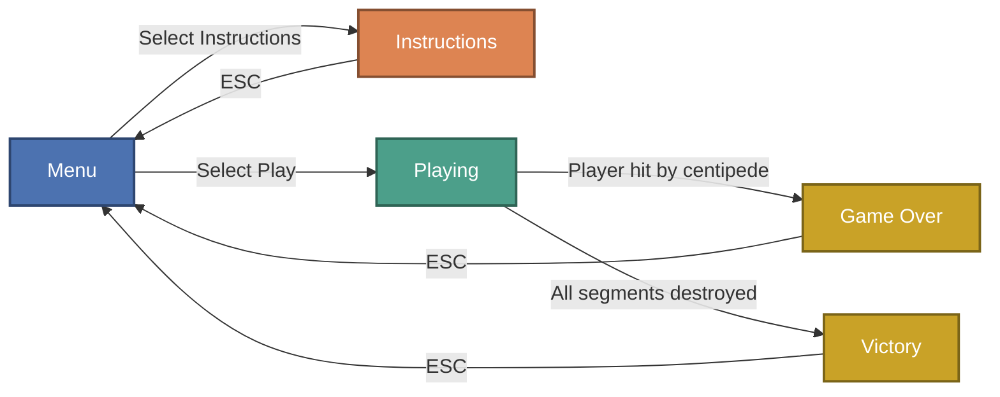

# Centipede Clone

A modern C++14 clone of the classic arcade game **Centipede**, built using [SFML](https://www.sfml-dev.org/) for graphics and audio. The game features a menu, instructions, scoring, and classic centipede gameplay with mushrooms, bullets, and split mechanics.

## Features

- Classic centipede gameplay: shoot the centipede as it winds through a field of mushrooms.
- Player movement and shooting (arrow keys, spacebar, or mouse click).
- Dynamic centipede splitting and direction reversal when segments are hit.
- Mushrooms (including poison and half-destroyed states) that can be destroyed for points.
- Menu system with Play, Instructions, and Quit options.
- Victory and Game Over screens with scoring.
- Background music and sound effects.

## Project at a Glance

Scoring is computed directly from three counters tracked in `Centipede.cpp` (`score = 1*mushroomDead + 10*bodyC + 20*headC`) — hitting the centipede's head is worth 20x more than clearing a mushroom:

<picture>
  <source media="(prefers-color-scheme: dark)" srcset="docs/charts/scoring-by-target-dark.png">
  
</picture>

### Game state flow

The game runs on a `GameState` enum (`MENU`, `PLAYING`, `INSTRUCTIONS`, `GAME_OVER`, `VICTORY`). Instructions is a side branch off the menu, while Playing resolves into either ending based on whether the player dies first or clears every centipede segment first:

### Sprite gallery

A sample of the real shipped game art from `CentipedeClone/Textures/`:

<table>
<tr>
<td align="center"> player.png</td>
<td align="center"> c_head_left.png</td>
<td align="center"> mushroom.png</td>
<td align="center"> halfMushroom.png</td>
</tr>
<tr>
<td align="center"> explosion.png</td>
<td align="center"> spider_and_score.png</td>
<td align="center"> game_over.png</td>
<td align="center"> you_won.png</td>
</tr>
</table>

## Controls

- **Arrow Keys**: Move player
- **Spacebar** or **Mouse Click**: Shoot bullet
- **ESC**: Return to menu

## Scoring

- **Mushroom destroyed**: 1 point
- **Centipede body segment destroyed**: 10 points
- **Centipede head destroyed**: 20 points

## How the Centipede Moves

The centipede is stored as a flat array `float centipede[Csize][4]` (`Csize = 12`), where each row holds `{x, y, exists, movingRight}`. There's no linked list or parent/child pointer chain — segment `i` simply follows behind segment `i - 1` by array position, and a parallel `bool segmentIsHead[Csize]` flags which entries currently act as a head. All of this is driven once per frame by `moveCentipedeLR()`, gated by `centipedeClock` so it only actually steps every 200ms regardless of how fast the render loop spins.

**Head movement.** For every segment where `segmentIsHead[i]` is true, the function checks two things before moving it:
1. **Screen-edge check** — if the segment is at `x <= 0` while moving left, or at `x >= resolutionX - boxPixelsX` while moving right, that's a wall hit.
2. **Mushroom check** — it converts the head's pixel position to grid cell (`x / boxPixelsX`, `y / boxPixelsY`), looks one cell ahead in the direction of travel, and checks `gameGrid[nextCellX][headGridY]` for value `1` (mushroom) or `3` (half-eaten mushroom).

If either condition trips, the head does **not** move sideways that tick — instead it drops down one row (`y += boxPixelsY`) and flips its direction bit (`centipede[i][3] = !centipede[i][3]`). Otherwise it just slides one grid cell (32px) in its current direction. This is the classic "hit a wall or a mushroom, drop and reverse" Centipede behavior, and here it is resolved per-head, so a split centipede with two heads (see below) can be turning in opposite corners of the field independently.

**Body follow-through.** Before any positions are updated, the function snapshots every segment's current `{x, y}` into a `prevPositions` buffer. Then, for each non-head segment `i`, it looks for `j = i - 1` (the previous array slot) and — if that segment still exists — moves segment `i` into segment `j`'s *pre-move* position and copies `j`'s direction bit. That one-frame-lagged "step into where the segment ahead of you used to be" is what produces the visual "conga line" of the body trailing the head around corners; there's no independent physics or spline for the body, just an index-shifted copy of last frame's positions.

## Collision Detection

None of the collision checks in this codebase use SFML's `sf::Sprite::getGlobalBounds().intersects()`. `getLocalBounds()` only shows up for centering text/sprite origins (e.g. `titleText.setOrigin(...)`, `centipedeHeadSprite.setOrigin(...)`). Every actual hit test is hand-rolled arithmetic on the raw `float[]` coordinate arrays or on the `int gameGrid[gameRows][gameColumns]` occupancy grid:

- **Bullet vs. centipede** (`splitC()`): a manual axis-aligned check — `bullet[y]` must fall within `[centipede[i][y], centipede[i][y] + boxPixelsY]` and `bullet[x]` within `[centipede[i][x], centipede[i][x] + boxPixelsX]`. No sprite bounds are consulted at all, just the two position arrays.
- **Bullet vs. mushroom** (`destroyMushroom()`): this one isn't sprite-vs-sprite at all — it walks the entire `gameGrid` looking for an occupied cell (`1`/`2` = full, `3`/`4` = half) whose cell rectangle contains the bullet's position (`bullet[x] + 16` for the horizontal center, `bullet[y]` for the leading edge). A first hit degrades a full mushroom to its half-eaten state (`1→3`, `2→4`); a second hit on an already-half mushroom clears the cell to `0` and increments `mushroomDead` — i.e. mushrooms take two shots to destroy.
- **Player vs. centipede** (`deadPlayer()`): a shrunk-box AABB test — both the player's and the segment's hitboxes are inset by 8px (`boxPixelsX - 8` / `boxPixelsY - 8`) before checking `xOverlap && yOverlap`, so the two 32px sprites need substantial visual overlap, not just edge-touching, before `player[exists]` is set to `false`.
- **Centipede vs. mushroom** (movement turning): also grid-based, not sprite-based — see the "Mushroom check" step above and in `mVSc()` (which duplicates that same grid lookahead but, per the *Known Limitations* section below, is never actually called).

In short: everything here is grid-cell and raw-coordinate math rather than SFML's built-in bounding-box intersection helper, which also explains why hitboxes (like the player's 8px inset) had to be tuned by hand rather than derived from the sprites' real bounds.

## Frame Timing & Game Loop

The `while(window.isOpen())` loop has **no `setFramerateLimit()` and no vertical sync enabled**, so it renders and polls events as fast as the OS/GPU will allow. Rather than scaling movement by real delta-time, the game gates individual behaviors with dedicated `sf::Clock` instances that are checked and conditionally `restart()`-ed every frame:

- `bulletClock` lets `moveBullet()` advance the bullet by 10px only once at least 5ms have elapsed since the last move.
- `centipedeClock` lets `moveCentipedeLR()` advance the centipede by one 32px grid cell only once at least 200ms have elapsed.

Everything else (player movement, drawing, collision checks) runs on every single iteration of the loop with no throttle, since player movement is driven directly by discrete `KeyPressed` events rather than a per-frame poll. The practical effect is a fixed, frame-rate-independent walking pace for the centipede and bullet (as long as the machine can sustain >200ms/~5ms ticks), at the cost of the main loop otherwise spinning uncapped and doing full redraw work every iteration.

## Known Limitations & Possible Enhancements

Verified directly against `CentipedeClone/Centipede.cpp` and `CentipedeClone/Textures/` — not inferred from filenames alone:

- **No persistent high score.** There is no file I/O anywhere in the source (no `ifstream`/`ofstream`, no save file) — `score` is a plain `int` that resets to `0` every time `resetGame()` runs, so nothing survives a restart. A simple `highscore.txt` read/write around `resetGame()` and the game-over transition would be a natural first enhancement.
- **No difficulty scaling.** The centipede's move interval is a hardcoded `200ms` in `moveCentipedeLR()`, the bullet's is a hardcoded `5ms` in `moveBullet()`, and `Csize` (12 segments) never changes — nothing in the code increments a level counter, speeds up the centipede, or spawns more segments/mushrooms as play continues. Every playthrough is the same fixed pace and mushroom count (`rand() % 11 + 20`, i.e. 20–30) from `mushrooms()`.
- **Spider, flea, and scorpion are assets only — not gameplay.** `Textures/spider_and_score.png`, `Textures/flea.png`, and `Textures/scorpion.png` ship in the repo, but a full-text search of `Centipede.cpp` turns up zero references to "spider", "flea", or "scorpion" — no texture load, no position array, no spawn logic. Only `player.png`, `bullet.png`, `c_head_left.png`, `c_body_left.png`, `mushroom.png`, `halfMushroom.png`, `jkk.jpg`, `game_over.png`, and `you_won.png` are ever passed to `loadFromFile()`. The same is true of `background.png`, `death.png`, `explosion.png`, `mushroom1.png`, `gameover.jpg`, `jk.jpg`, `you_won.jpg`, and the `_walk` variants of the centipede head/body sprites — present in `Textures/` but never loaded, so the classic Centipede bonus enemies and the walk-cycle animation frames are unused art rather than working features.
- **`mVSc()` is dead code.** It's declared, defined, and fully implemented (grid lookahead for centipede-vs-mushroom turning), but it is never called from `main()` or anywhere else — the equivalent logic was instead duplicated inline inside `moveCentipedeLR()`. Removing the unused function (or actually wiring it in and removing the duplicate inline block) would be a good cleanup.
- **No two-player support.** There is exactly one `player[3]` array and one set of arrow-key/space bindings; nothing in the input handling or draw calls accounts for a second player.
- **No mushroom-overlap protection at spawn.** `mushrooms()` places 20–30 mushrooms with `rand() % gameRows` / `rand() % (gameColumns - 5)` and no check against cells that are already occupied, so two mushrooms can silently land on the same cell (the second `gameGrid` write just overwrites the first).
- **Explosion/death art isn't animated in.** `explosion.png` and `death.png` exist under `Textures/` but destruction of a centipede segment or mushroom is instantaneous in code (`exists = false` / grid value flips) — there's no explosion sprite or particle shown at the moment of impact.

These are good, scoped starting points for anyone picking up the project next: wiring in one of the unused enemy sprites (spider is the most iconic Centipede bonus target) or adding a simple score-multiplier per level would both build on logic that's already partly in place (the grid, the scoring counters, the split mechanic) rather than requiring a rewrite.

## How to Build

1. **Dependencies**:
    - [SFML 2.5+](https://www.sfml-dev.org/download.php) (Graphics, Window, Audio)
    - C++14 compatible compiler (tested with Visual Studio 2022)

2. **Project Setup**:
    - Place all required textures in a `Textures/` folder:
        - `player.png`
        - `bullet.png`
        - `c_head_left.png`
        - `c_body_left.png`
        - `mushroom.png`
        - `halfMushroom.png`
        - `game_over.png`
        - `you_won.png`
    - Place background music in a `Music/` folder:
        - `field_of_hopes.ogg`
    - Place a font file (e.g., `arial.ttf`) in the project root.

3. **Build**:
    - Open the solution in Visual Studio 2022.
    - Ensure SFML include and lib directories are set in project properties.
    - Build and run.

## How to Play

- Select "Play Game" from the menu.
- Move your player using the arrow keys.
- Shoot at the centipede and mushrooms to score points.
- Avoid colliding with the centipede.
- The game ends in victory when all centipede segments are destroyed, or game over if the player is hit.

## Notes

- Window size and position can be adjusted in the code (`window.setSize`, `window.setPosition`).
- All assets must be present in the correct folders for the game to run.
- The game grid and logic are tuned for a 960x960 resolution but can be adjusted.
- SFML is vendored under `include/` and `lib/` for convenience so the project builds without a separate SFML install.

## License

This project is for educational purposes. All third-party assets (images, music, fonts) should be properly licensed for your use.

---

Enjoy playing Centipede Clone!
